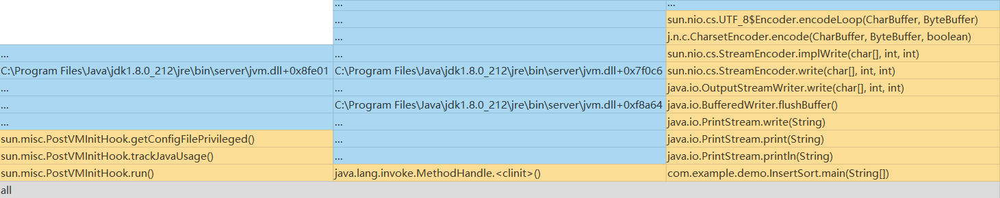

# 插入排序分析
## *步骤*
- 插入排序算法
- profiler效能分析

* * *
## *插入排序算法*
```java
package com.example.demo;

public class InsertSort {
    private int[] array;
    private int length;

    public InsertSort(int[] array){
        this.array = array;
        this.length = array.length;
    }

    public void display(){
        for(int a: array){
            System.out.print(a+" ");
        }
        System.out.println();
    }

    /*
     * 插入排序方法
     */
    public void doInsertSort(){
        for(int index = 1; index<length; index++){//外层向右的index，即作为比较对象的数据的index
            int temp = array[index];//用作比较的数据
            int leftindex = index-1;
            while(leftindex>=0 && array[leftindex]>temp){//当比到最左边或者遇到比temp小的数据时，结束循环
                array[leftindex+1] = array[leftindex];
                leftindex--;
            }
            array[leftindex+1] = temp;//把temp放到空位上
        }
    }

    public static void main(String[] args){
        int[] array = {38,65,97,76,13,27,49};
        InsertSort is = new InsertSort(array);
        System.out.println("排序前的数据为：");
        is.display();
        is.doInsertSort();
        System.out.println("排序后的数据为：");
        is.display();
    }

}

```

## *profiler分析*
使用Windows Async Profiler进行分析 ，得到火焰图如下


## *结果分析*
- 可以看出2/3的时间为Java JVM虚拟机相关的方法的启动
- 只有1/3的时间被用于插入排序
