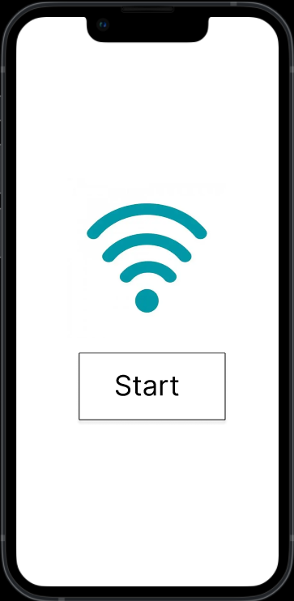
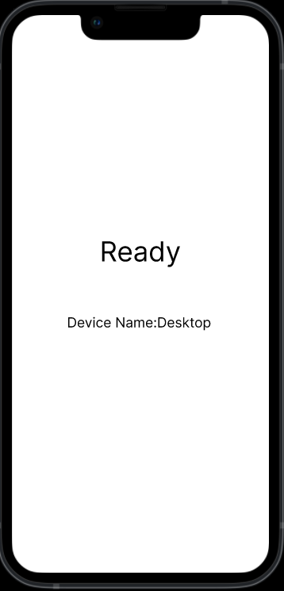
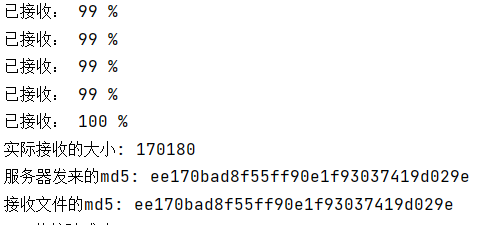
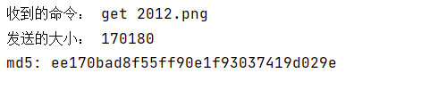

# AirDrop 编程
## 一、软件基本介绍
* 软件采用Python进行编程实现，主要分为文件传输以及剪切板读取。
* 所使用的包为socket，以及pyperclip。
## 二、使用方法
点击Start开始连接，连接成功后出现Ready


## 三、关键代码
* 客户端发送文件
```python
# 发送文件
# 1.先发送文件大小，让客户端准备接收
size = os.stat(filename).st_size  #获取文件大小
conn.send(str(size).encode("utf-8"))  # 发送数据长度
print("发送的大小：", size)

# 2.发送文件内容
conn.recv(1024)  # 接收确认

m = hashlib.md5()
f = open(filename, "rb")
for line in f:
    conn.send(line)  # 发送数据
    m.update(line)
f.close()

# 3.发送md5值进行校验
md5 = m.hexdigest()
conn.send(md5.encode("utf-8"))  # 发送md5值
print("md5:", md5)
```
* 剪切板同步
```python
def clipboard_get(self):
    """获取剪贴板数据"""
    data = pyperclip.paste()
    return data

def main(self):
    # 后台脚本：每隔0.2秒，读取剪切板文本，检查有无指定字符或字符串，如果有则执行替换
    # recent_txt 存放最近一次剪切板文本，初始化值只多执行一次paste函数读取和替换
    recent_txt = self.clipboard_get()
    while True:
        # txt 存放当前剪切板文本
        txt = self.clipboard_get()
        # 剪切板内容和上一次对比如有变动，再进行内容判断，判断后如果发现有指定字符在其中的话，再执行替换
        if txt != recent_txt:
            recent_txt = txt  # 没查到要替换的子串，返回None
            return recent_txt

            # 检测间隔（延迟0.2秒）
        time.sleep(0.2)
```
* 服务器接受文件
```python
# 1.先接收长度，建议8192
server_response = client.recv(1024)
file_size = int(server_response.decode("utf-8"))

print("接收到的大小：", file_size)

# 2.接收文件内容
client.send("准备好接收".encode("utf-8"))  # 接收确认
filename = "new" + content.split(" ")[1]

f = open(filename, "wb")
received_size = 0
m = hashlib.md5()

while received_size < file_size:
    size = 0  # 准确接收数据大小，解决粘包
    if file_size - received_size > 1024: # 多次接收
        size = 1024
    else:  # 最后一次接收完毕
        size = file_size - received_size

    data = client.recv(size)  # 多次接收内容，接收大数据
    data_len = len(data)
    received_size += data_len
    print("已接收：", int(received_size/file_size*100), "%")

    m.update(data)
    f.write(data)

f.close()

print("实际接收的大小:", received_size)  # 解码

# 3.md5值校验
md5_sever = client.recv(1024).decode("utf-8")
md5_client = m.hexdigest()
print("服务器发来的md5:", md5_sever)
print("接收文件的md5:", md5_client)
if md5_sever == md5_client:
    print("MD5值校验成功")
else:
    print("MD5值校验失败")


```
## 四、单元测试
测试传输图片




测试成功

## 五、亮点
1，简洁明了，省去了许多冗余的功能，保证了软件的方便实用。
2，传输速率较快，对于传送较大的文件依旧有不错的速度。
3，安全可靠，采用了md5校验，保证了传输的可靠性。
